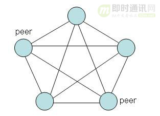

# 分享会

# 引子

- 为什么想到看分布式哈希表
    - 曾经在做MIT6.824的Raft时，还有在看IPFS的时候，进行递归搜索的时候看到过
    - 在上交的某牛逼同学的大作业
- 为什么想和大家分享分布式哈希表
    - 【彻底无中心】的分布式系统的【关键基础设施】
    - 读到论文的时候感觉设计非常巧妙
    - 有助于大家未来理解其他的分布式协议
    - 集中式结构的尽头是分布式

# 从P2P开始？

### C/S架构


### P2P架构




P2P的物理网络理论上是：

1. 对称的（A to B 则 B to A）
2. 可传递的（A to B，B to C，则A to C）

### P2P有什么用：

- 可扩展性
- 高容错性
- 负载均衡（提高性能）（以BT为例）

### 物理网络和覆盖网络（O**verlay Network）**

- 覆盖网络之上可以有第二层覆盖网络

### 中继？打洞？有NAT咋办？

- 首先是犯下了傲慢之罪的NAT：NAT原理
- UDP打洞和TCP打洞

### P2P应用

# Why DHT？

### P2P面临的困难

- 节点发现
- 海量节点状态维护
- 高效查询和资源定位

### P2P内容查询算法的三次变革

- 朴素P2P——中央服务器——单点故障
- 泛洪——坏文明——广播风暴
- DHT——好！

# What's DHT？

Distribute Hash Table 只是一种规范，并不是某个具体实现。DHT希望将一个键值对，尽量分散地存储在分布式网络当中的节点上。

- 分布式中的每一个节点是完全平等的
- 距离算法
- 散列算法的选择决定DHT的上限

# 散列算法

将一段数据映射成一段数据

散列算法基本要求：可重入、避免碰撞

评价散列算法好坏的标准：

- 尽量少的碰撞
- 尽量分散的输出

｜- 不可逆加密（散列算法）

｜- 可逆加密 -｜-  对称加密            

                              ｜- 非对称加密      

- 不可逆加密（散列算法）
    - 取模运算是最简单的哈希算法，但不是唯一的哈希算法
    
    ```go
    func naiveHash(val int) int {
        return ((val * 1919810) / 114514) % 65536
    }
    ```
    
    - BKDR是一种简单快捷的hash算法，也是Java目前采用的字符串的Hash算法。
    
    ```java
    public int BKDRHash(str string)  {
        int seed = 131;
        int hash = 0;
        for (int i = 0; i < str.length(); i++) {
                hash = hash * seed + str.charAt(i);
        }
        return hash;
    }
    ```
    
    - 其他重量级hash算法
        - MD5（128位）
        - SHA-1（160位）

# How to DHT？

### Chord——最经典的实现

Chord 诞生于2001年。第一批 DHT 协议都是在那年涌现的，另外几个是：[CAN](https://en.wikipedia.org/wiki/Content_addressable_network)、[Tapestry](https://en.wikipedia.org/wiki/Tapestry_(DHT))、[Pastry](https://en.wikipedia.org/wiki/Pastry_(DHT))。俺之所以选取 Chord 来介绍，主要是因为 Chord 的原理比较简单（概念好理解），而且相关的资料也很多。

（请允许俺稍微跑题，聊一下 IT 八卦）Chord 是 MIT 的几个技术牛人一起搞出来的，这几个牛人中包括世界级的黑客：罗伯特·莫里斯（[Robert Morris](https://en.wikipedia.org/wiki/Robert_Tappan_Morris)）。

- 协议
    - 环形覆盖网络
    - 数据key和节点id同构
    - 后继节点维护数据
    - Finger Table
    - 节点的加入和退出
- 对节点来说
    - join()
    - stabilization()
    - fixFinger()
    - RPC调用（get/put）
- 对数据来说
    - put
    - lookUp
    - remove
    - modify
- 和Raft比较（Raft是一致性协议）

### 

# 有啥用？

DHT 最早用于 P2P 文件共享和文件下载（比如：BT、电驴、电骡），之后也被广泛用于某些分布式系统中，比如：

> 分布式文件系统分布式缓存暗网（比如：I2P、Freenet）
无中心的聊天工具/IM（比如：TOX）
无中心的微博客/microblogging（比如：Twister）
无中心的社交网络/SNS
> 

BitTorrent分段下载加速

> 云计算中的分布式云计算/分布式存储——和 Raft 协议比较
P2P直播
> 

DHT是分布式系统的基础设施

#